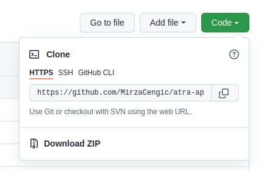

# *Alpine salamander* Supplementary Info Shiny app

This is the repository with digital Supplementary Information for the
alpine salamander paper \[title peding\]. You can clone this entire
repository and run the app locally. RStudio project is built with
[`renv`](https://rstudio.github.io/renv/) package manager.

## How to install

### Clone the repository

If you have git available on your computer, run git command below.

``` git
git clone https://github.com/MirzaCengic/atra-app.git
```

Otherwise, you can download zip file of the project, including data and
packages (Code -\> Download ZIP).

<center>



</center>

Open RStudio project file `atra-app.RProj`. First you will need to set
up packages with `renv`. Run code below to setup packages. Install
package if needed.

``` r
# Install renv package if needed
install.packages("renv")

# Use renv::init() to initialize a project. renv will discover the R packages used in your project, 
# and install those packages into a private project library.
renv::init()
```

## How to run the app?

  - Open script `R/run_app.R` and source all files

This script will source scripts with initial setup, and Shiny app user
interface and backend setup. If script `R/app_setup.R` is sourced
sucessfuly, this means that the app should work right away.

  - Run function `runApp()`

This will attempt launching the browser with the app.
